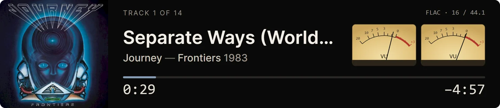

# AlbumWall

A player for a music library you own, built around seeing the whole collection
at once — from folders on your computer, or as a client for a
[Navidrome](https://www.navidrome.org) server.


The library is a wall of cover art. Clicking a record unfolds it in place —
the wall never goes away, the album opens inside it, tinted by its own sleeve —
and the sleeve is the play button. It is meant to feel like flipping through a
bin of CDs looking for something to listen to, which is the part most players
get wrong.

Early, and built for one person's library first. It works, on Linux and on
Windows, and it has been its author's daily player on both since the day it
could play music.

<p align="center">
  
  
</p>

## What it does

- **A wall of covers** that scrolls through any size of library; only what is
  near the screen is ever loaded. Sorted by artist (a leading *The*, *A* or *An* is
  ignored), then year, then title.
- **Albums open in place**, centered, colored from their own artwork, with the
  track list inside the wall rather than on another page.
- **Gapless playback**, handed to the system at the file's own sample rate, with ReplayGain by album
  or by track. Gapless is measured, not assumed — see `tools/gapless-check.cs`.
- **It picks up where you left off**: the album, the track, how far in, and the
  album you had open — paused, until you press play. Both halves are options.
- **It watches the music folder.** Records you add, change or remove appear by
  themselves; there is nothing to press.
- **The colors are your collection's.** The window has no theme of its own: it
  takes the hue your covers lean toward and builds itself from that. Preferences
  › Appearance decides how light it sits and how much of the hue it takes.
- **Compact mode** (Ctrl+M, or the button beside full screen): the window
  becomes a strip showing what is playing — cover, track, format, progress —
  with a pair of analog VU meters that swing like real ones. Hover it for the
  play controls and the way back; Esc or Ctrl+M returns to the wall exactly as
  you left it. After two minutes paused it shows a clock instead. On a Linux
  Wayland desktop the strip and the wall share one window position; see
  [where the window opens](#linux-where-the-window-opens).

  

- **Full screen** (F11): the bars step aside and come back when the pointer (or
  a finger) reaches an edge. Built for a touchscreen as much as a desk.
- **A Navidrome client.** Sign in to a Navidrome server — or any server that
  speaks Subsonic — and its albums are a wall like any other, streamed gapless,
  with the server's covers. The password signs in once and is not kept. A server
  with more than one library of its own (a lossless one and a lossy one, say)
  asks which you want, and each becomes a wall of its own.
- **More than one library**: folders and servers, added under Preferences ›
  Library and switched between from the bottom bar. They are never merged.
- **Right-click** an album or a track to play it, show its file, copy its path,
  or open **Properties**: the tags, the audio, the sleeve front and back, the
  ripper's log if there is one beside the album, and the lyrics if they are
  embedded. Step through an album's tracks from the window's header.
- **Media keys and the desktop's own controls** — MPRIS on Linux (the GNOME
  panel and lock screen), the media flyout and hardware keys on Windows.
- **The keyboard works**: Space to play or pause, Ctrl+arrows for the next and
  previous track, arrows to seek, Ctrl+F to search, Esc to back out, Ctrl+M for
  compact, F11 for full screen, and F1 for the list — Preferences › Help has
  every key and every search the box understands.
- **Live search** by artist or album, a way back to whatever is playing, and
  three searches for art that wants attention: `art:missing`, `art:small`,
  `art:nonsquare`.
- **Statistics**: press the library counts in the bottom bar for file types,
  bitrates, lossless formats, playing time, size on disk and the state of the
  cover art.
- The play controls slide in when something is loaded and leave when the record
  ends. They sit above the bottom bar, or under the title bar if you prefer.
- **The paperwork is light, the music dark.** The wall takes its color from your
  covers; Preferences and Properties are plain light pages, easy to read, with
  the wall behind showing any change to its color as you make it.
- **An integrity check**, if you tick it: FLAC files are checked against the
  checksum inside them, a little at a time, and any damage is listed (see below).

<p align="center">
  
  
</p>

- **It updates itself.** Preferences › About checks GitHub for a newer release,
  downloads the build for your platform, checks it against the release's
  SHA-256 list, and restarts into it. A dot on the gear says there is one; nothing
  is ever downloaded until you ask.

Not built yet: editing tags other than lyrics, an A–Z rail.
What is wanted next is in [docs/roadmap.md](docs/roadmap.md).

The screenshots are the author's own library. The covers belong to their
artists and labels and are shown, small, to illustrate the software.

## Your music

**The first time it runs, it asks where your music is**, and reads nothing
until you answer: a folder on this computer (an external drive or a network
share counts), or a Navidrome server to sign in to. *Look in the usual places*
checks your Music folder, OneDrive's and a `Music` folder at the top of each
drive (on Linux, `~/Music` and mounted drives) and offers what it finds; it
counts files from the folder listings and opens none of them. More folders and
servers can be added later under Preferences › Library.

Reads FLAC, MP3, M4A, Ogg, Opus and WAV.

**Cover art** is taken from the tags — any track of the album will do — and
from a `cover.jpg`, `cover.png`, `folder.jpg` or `front.jpg` beside the tracks
only if no track carries one. Art is never fetched from the internet: the files
are the truth, and better art belongs in them.

Albums are grouped by **album artist and album title**, and the year is taken
from a `YEAR - Album` folder name where there is one, so a box set does not
scatter itself across a decade and a reissue date does not misfile a record.

**The files are not changed** unless you ask. The one thing AlbumWall can
write is a track's lyrics, from Properties, and only in a library where you
have ticked *Allow editing* in Preferences › Library. It is off for every
library until you do. Each edit keeps the old lyrics in a backup file first.

**An integrity check, if you want one.** Tick *Check the audio for damage now
and then* on a folder library in Preferences › Library, and AlbumWall decodes
each FLAC file in the background and compares it with the checksum stored
inside it, as `flac -t` does: new and changed files soon, every file again once
a month, one at a time at low priority, and only while AlbumWall is open. It
only reads. What it finds is under the library in Preferences, every damaged
file is listed in `integrity.log` beside the settings, and the dot on the gear
says so. Off until you turn it on. MP3 and AAC carry no checksum of their
audio, so only FLAC is checked; it needs the system's libFLAC.

### From a Navidrome server

A server library is read-only: AlbumWall plays the files as the server holds
them and changes nothing there. The server's album list and covers are kept on
this computer, so the wall opens at once and is brought up to date behind it.
Properties shows what the server says about a track — its tags and, where the
server offers them, its lyrics — without downloading the file.

### It remembers what it has read

Opening a file on Windows costs a virus scan, and fifteen thousand of them are
two and a half minutes; over a network share, or off a large library on Linux,
it is still many seconds. So the app keeps an index (`index.db`, beside its
settings) and does not open a file whose path, size and modified time it
recognizes: a library that size opens in a fraction of a second. The index is a
cache and nothing else — delete it and it is rebuilt.

The one thing it cannot see is a tag edit that keeps both the size and the date
of the file, made while the app was closed. **Rescan**, on the library's row in
Preferences › Library, opens every file and rebuilds the index; that is what it
is for.

## Installing

Download the zip for your machine from the
[latest release](https://github.com/gsa700/albumwall/releases/latest):

| your machine | the file |
|---|---|
| Windows 10 or 11 (64-bit) | `AlbumWall-win-x64.zip` |
| a Linux PC | `AlbumWall-linux-x64.zip` |
| a Raspberry Pi 4 or 5, 64-bit OS | `AlbumWall-linux-arm64.zip` |

Unzip it and run `AlbumWall` (`AlbumWall.exe` on Windows). The releases named
`libmpv-*` are the audio engine the app is built with, not something to download.

A release is one file. Run it from wherever you unzipped it and it offers to
install itself — per user, no administrator rights: into
`%LocalAppData%\Programs\AlbumWall` on Windows (listed in Installed apps, with a
Start Menu shortcut), or `~/.local/share/albumwall` on Linux (in your
applications menu, plus an `albumwall` command). `--install` and `--uninstall`
do the same from a terminal; add `--quiet` for scripts. Uninstalling keeps your
settings unless you say otherwise, and does not touch your music. It can also be
removed from Preferences › About.

To run it from a folder or a USB stick and leave no trace on the machine, put
an empty file named `portable.txt` beside it.

Windows 10 or later, or a current Linux desktop with glibc 2.36 or newer:
Debian 12, Raspberry Pi OS bookworm, Ubuntu 24.04, Fedora, and anything later.
Ubuntu 22.04 is too old. The player is
inside the file; nothing else has to be installed. On Linux it plays through
PipeWire or PulseAudio, which every desktop already has.

### Linux: where the window opens

On a Wayland desktop an application is not allowed to know or choose where its
window is, so AlbumWall opens wherever the desktop puts it, and the wall and the
compact strip share one position. To have the app remember its own places, run
it through XWayland instead: with AlbumWall closed, open its settings file
(`~/.config/albumwall/settings.json`) and change the `Backend` line to

```json
"Backend": "x11",
```

Set it back to `null` to return to Wayland. On Windows, and on an X11 desktop, the window
remembers where it was, and compact mode keeps a place of its own.

### A dedicated player

AlbumWall can also be the only thing a machine runs: full screen on its main
screen, with an optional front panel — a small bar display showing what is
playing, VU meters and all — for a player built into a stereo. Setting that up on
a Raspberry Pi is in [docs/kiosk.md](docs/kiosk.md); the files are in `kiosk/`.

## Building it

Needs the **.NET 10 SDK** and **libmpv**. Everything else comes from NuGet.

**Linux**

```sh
sudo dnf install mpv-libs          # Fedora
sudo apt install libmpv2           # Debian/Ubuntu

dotnet run --project src/AlbumWall.App
```

A development build uses the distribution's libmpv. A release carries its own,
built by `scripts/build-libmpv/` — audio only, the same on every platform — and
published on this repository as `libmpv-*` releases, with its source.

`scripts/release.sh` cuts a release: it fetches that engine by the tag in
`scripts/LIBMPV_RELEASE`, builds all three platforms, and makes a draft
(`--dry-run` to only build the zips).

**Windows**

```powershell
.\scripts\get-libmpv.ps1           # once: fetches libmpv-2.dll
dotnet run --project src\AlbumWall.App
```

libmpv is not committed to this repository: it is a binary of other people's
GPL and LGPL projects. The script fetches this project's own audio-only build
from the pinned `libmpv-*` release here and checks it against the release's
SHA-256 list, so a development build plays through the same library a release
carries. `-Upstream` fetches the official full build from SourceForge instead.
The project copies the DLL next to the executable when you build.

If something goes wrong, the app keeps a log of its last two runs beside its
settings: `%AppData%\albumwall\albumwall.log`, or `~/.config/albumwall/`.
Notes from bringing it up on Windows are in
[docs/windows-notes.md](docs/windows-notes.md).

## License

GPL v3 or later — see [LICENSE](LICENSE).

A release carries other people's work inside it: the audio engine is
[libmpv](https://mpv.io) (GPL v2 or later) over [FFmpeg](https://ffmpeg.org)
(LGPL), the tags are read by [TagLib#](https://github.com/mono/taglib-sharp)
(LGPL), the interface is [Avalonia](https://avaloniaui.net) (MIT), and the
typeface is [Inter](https://rsms.me/inter/) (OFL). None of it is modified.
Every component, what it does here, its license and where its source is:
[THIRD-PARTY-NOTICES.md](THIRD-PARTY-NOTICES.md) — the same page the app shows
under Preferences › About › What's inside.
