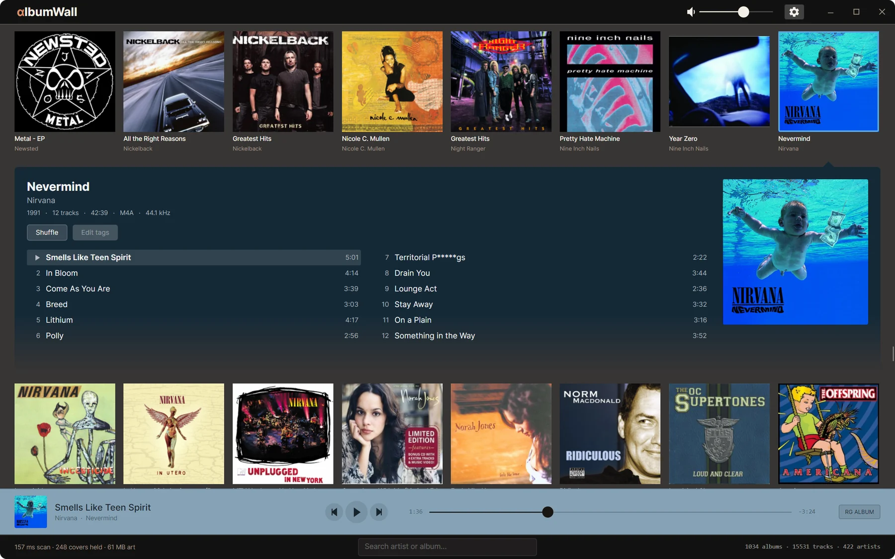
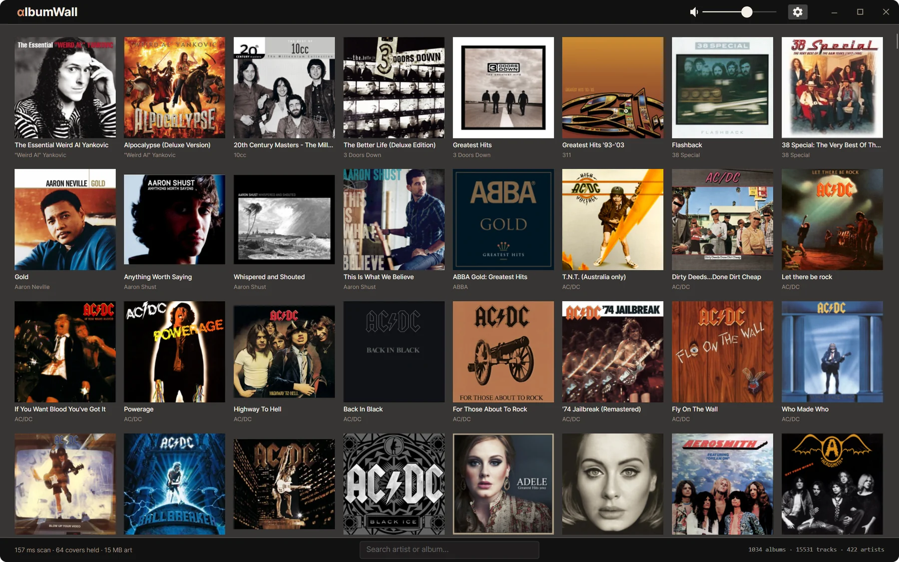
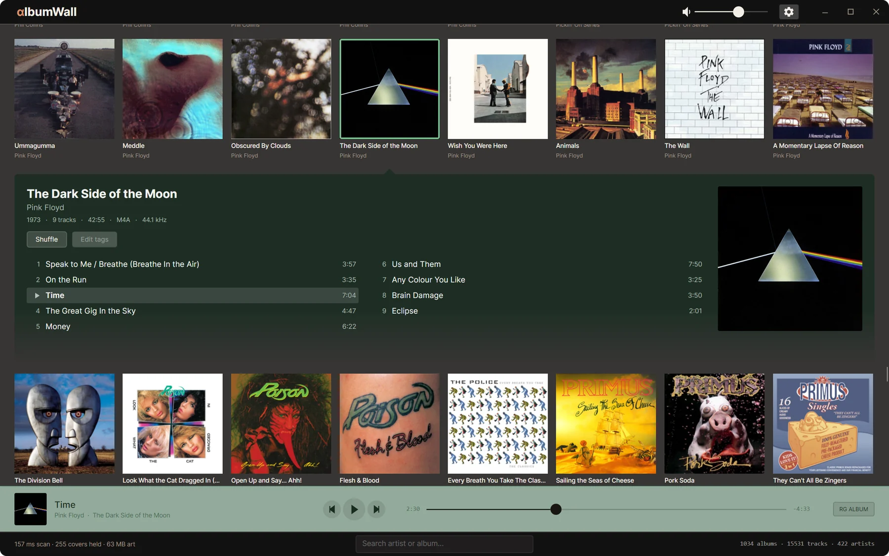
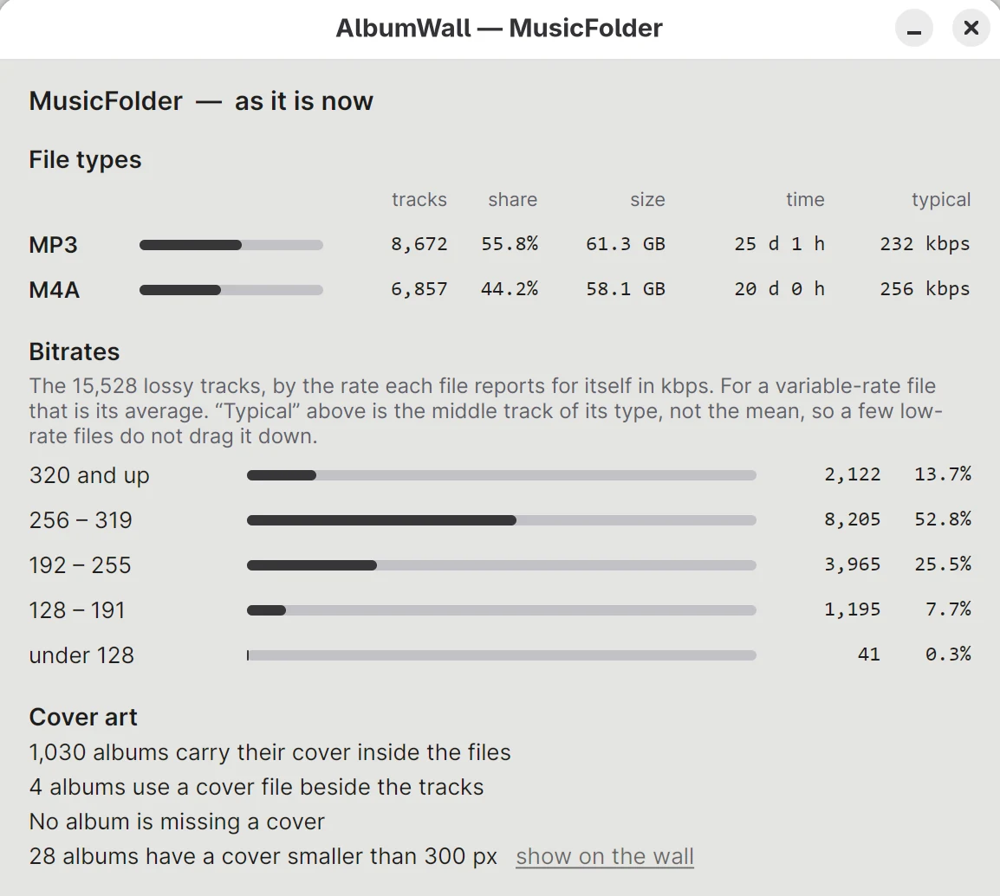
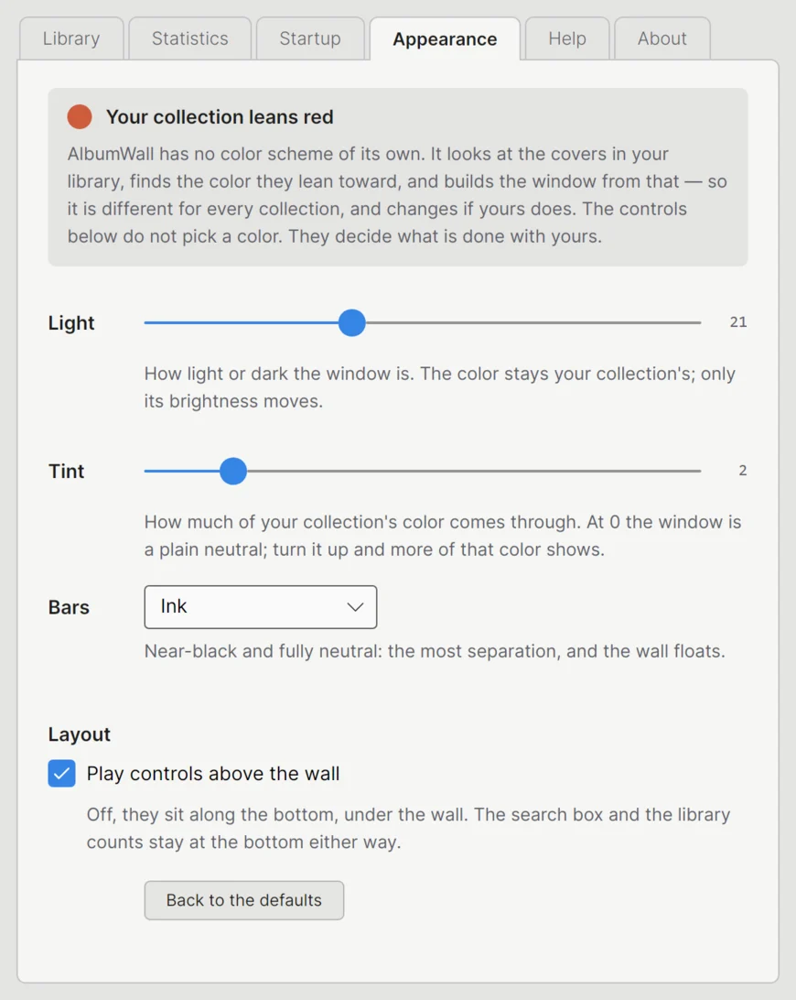

# AlbumWall

A player for a music library you own, built around seeing the whole collection
at once.



The library is a wall of cover art. Clicking a record unfolds it in place —
the wall never goes away, the album opens inside it, tinted by its own sleeve —
and the sleeve is the play button. It is meant to feel like flipping through a
bin of CDs looking for something to listen to, which is the part most players
get wrong.

Early, and built for one person's library first. It works, on Linux and on
Windows, and it has been its author's daily player on both since the day it
could play music.

<p>
  
  
</p>

## What it does

- **A wall of covers** that scrolls through any size of library; only what is
  near the screen is ever loaded. Sorted by artist (a leading *The*, *A* or *An* is
  ignored), then year, then title.
- **Albums open in place**, centered, colored from their own artwork, with the
  track list inside the wall rather than on another page.
- **Gapless playback**, at the file's own sample rate, with ReplayGain by album
  or by track. Gapless is measured, not assumed — see `tools/gapless-check.cs`.
- **It picks up where you left off**: the album, the track, how far in, and the
  album you had open — paused, until you press play. Both halves are options.
- **It watches the music folder.** Records you add, change or remove appear by
  themselves; there is nothing to press.
- **The colors are your collection's.** The window has no theme of its own: it
  takes the hue your covers lean toward and builds itself from that. Preferences
  › Appearance decides how light it sits and how much of the hue it takes.
- **Media keys and the desktop's own controls** — MPRIS on Linux (the GNOME
  panel and lock screen), the media flyout and hardware keys on Windows.
- **The keyboard works**: Space to play or pause, Ctrl+arrows for the next and
  previous track, arrows to seek, Ctrl+F to search, Esc to back out, and F1 for
  the list — Preferences › Help has every key and every search the box understands.
- **Live search** by artist or album, a way back to whatever is playing, and
  three searches for art that wants attention: `art:missing`, `art:small`,
  `art:nonsquare`.
- **Statistics**: press the library counts in the bottom bar for file types,
  bitrates, lossless formats, playing time, size on disk and the state of the
  cover art.
- The play controls slide in when something is loaded and leave when the record
  ends. They sit above the bottom bar, or under the title bar if you prefer.

<p>
  
  
</p>

- **It updates itself.** Preferences › About checks GitHub for a newer release,
  downloads the build for your platform, checks it against the release's
  SHA-256 list, and restarts into it. A dot on the gear says there is one; nothing
  is ever downloaded until you ask.

Not built yet: tag editing, a right-click menu, an A–Z rail.
What is wanted next is in [docs/roadmap.md](docs/roadmap.md).

The screenshots are the author's own library. The covers belong to their
artists and labels and are shown, small, to illustrate the software.

## Your music

It scans your **Music** folder — `~/Music`, or `%USERPROFILE%\Music` — and
everything under it. If your records live somewhere else, press the gear in the
top bar and choose the folder under Preferences › Library.

Reads FLAC, MP3, M4A, Ogg, Opus and WAV.

**Cover art** is taken from the tags — any track of the album will do — and
from a `cover.jpg`, `cover.png`, `folder.jpg` or `front.jpg` beside the tracks
only if no track carries one. Art is never fetched from the internet: the files
are the truth, and better art belongs in them.

Albums are grouped by **album artist and album title**, and the year is taken
from a `YEAR - Album` folder name where there is one, so a box set does not
scatter itself across a decade and a reissue date does not misfile a record.

**The files are not changed.** Nothing is written to your music folder.

### On Windows, it remembers what it has read

Opening a file on Windows costs a virus scan, and fifteen thousand of them are
two and a half minutes. So on Windows the app keeps an index (`index.db`, beside
its settings) and does not open a file whose path, size and modified time it
recognizes: a library that size opens in a fifth of a second. The index is a
cache and nothing else — delete it and it is rebuilt.

The one thing it cannot see is a tag edit that keeps both the size and the date
of the file, made while the app was closed. **Preferences › Library › Read
everything again** opens every file and rebuilds the index; that is what it is
for. On Linux, where opening files is cheap, every file is read at every start
and none of this applies.

## Installing

A release is one file. Run it from wherever you unzipped it and it offers to
install itself — per user, no administrator rights: into
`%LocalAppData%\Programs\AlbumWall` on Windows (listed in Installed apps, with a
Start Menu shortcut), or `~/.local/share/albumwall` on Linux (in your
applications menu, plus an `albumwall` command). `--install` and `--uninstall`
do the same from a terminal; add `--quiet` for scripts. Uninstalling keeps your
settings unless you say otherwise, and never touches your music. It can also be
removed from Preferences › About.

To run it from a folder or a USB stick and leave no trace on the machine, put
an empty file named `portable.txt` beside it.

Windows 10 or later, or a current Linux desktop. The player is inside the file;
nothing else has to be installed.

## Building it

Needs the **.NET 10 SDK** and **libmpv**. Everything else comes from NuGet.

**Linux**

```sh
sudo dnf install mpv-libs          # Fedora
sudo apt install libmpv2           # Debian/Ubuntu

dotnet run --project src/AlbumWall.App
```

A development build uses the distribution's libmpv. A release carries its own,
built by `scripts/build-libmpv/` — audio only, the same on every platform.

**Windows**

```powershell
.\scripts\get-libmpv.ps1           # once: fetches libmpv-2.dll (needs `gh auth login` while this repository is private)
dotnet run --project src\AlbumWall.App
```

libmpv is not committed to this repository: it is a binary of other people's
GPL and LGPL projects. The script fetches this project's own audio-only build
from the pinned `libmpv-*` release here and checks it against the release's
SHA-256 list, so a development build plays through the same library a release
carries. `-Upstream` fetches the official full build from SourceForge instead.
The project copies the DLL next to the executable when you build.

If something goes wrong, the app keeps a log of its last two runs beside its
settings: `%AppData%\albumwall\albumwall.log`, or `~/.config/albumwall/`.
Notes from bringing it up on Windows are in
[docs/windows-notes.md](docs/windows-notes.md).

## License

GPL v3 or later — see [LICENSE](LICENSE).

A release carries other people's work inside it: the audio engine is
[libmpv](https://mpv.io) (GPL v2 or later) over [FFmpeg](https://ffmpeg.org)
(LGPL), the tags are read by [TagLib#](https://github.com/mono/taglib-sharp)
(LGPL), the interface is [Avalonia](https://avaloniaui.net) (MIT), and the
typeface is [Inter](https://rsms.me/inter/) (OFL). None of it is modified.
Every component, what it does here, its license and where its source is:
[THIRD-PARTY-NOTICES.md](THIRD-PARTY-NOTICES.md) — the same page the app shows
under Preferences › About › What's inside.
